# Reflektion

## Kapitel 2

### Meaningfull names

Kapitel 2 ger sig in på namngivning av variabler och metoder. Mer pratar Martin om hur namn ska vara tydliga med vad variablen gör och de ska inte vara missledande. Vid varje koncept ska ett ord användas, så inte använda fetch och get, utan enbart en av de. Och han går också in på "svenskan" i det hela, verb för metoder, substantiv för variabler och en slags fråga för boolean värden, såsom isLoggedIn.

Här är några exemplen från min kod:

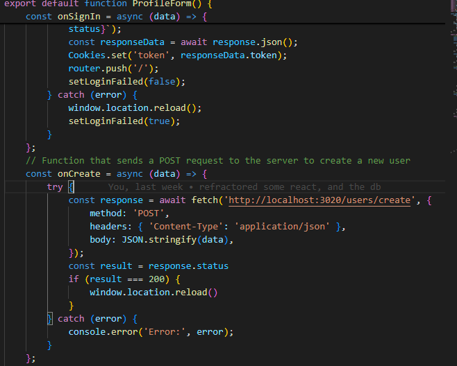

onCreate och onSingIn, är saker som sker vid ett visst event. Det är tydligt när de sker men lite mindre tydligt vad de gör, i de fallen har en kommentar lags till för yttligare tydlighet.
Man kan även se att set används när ett värde på något görs.
Däremot kan det diskuteras kring det booleanska värdet borde vara som en fråga, men eftersom det i detta fallet handlar om en setter för en react hook, så kändes det vettigare med set.

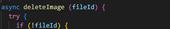
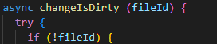
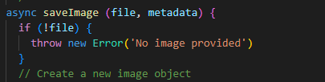

Ovan kan man se att ordet file används majoriteten av gångerna för att definera saker som har med bilder och filer att göra, ibland inom koden avänds däremot image, vilket kan ses som negativt eligt Martin

## Kapitel 3

### Functions

I kapitel 3 förklarar Martin bägge när och hur man ska använda sig av funktioner. En viktig sak enligt Martin är längden och funktionaliteten för de. Martin anser att de enbart skall göra en sak (Do one thing), och att de skall vara korta, sällan mer än 20 rader kod. Martin anser också att funktionerna ska vara helst, "niladic" och sedan "monadic" och "dyadic". Och att funkioner sällan ska ha 3 eller fler argument. Martin nämner även hur funktioner ej skall ha biverkningar, så de ska göra sitt och inte påverka något annat.

Ett problem med nextJs och react är att det är ett "functional programming language" vilket betyder att istället för att tillexempel ha ett objekt för varje komponent, så måste man ha en funktion för varje komponent.

Detta har lett till att delar av min kod ser ut såhär:

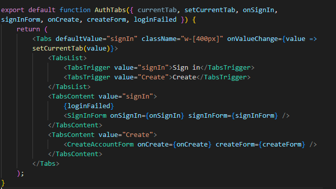

med stabila 7 stycken argument. Det är en nackdel ifall man vill följa Martins bok, men inom fall som dessa finns det tyvärr inte jättemycket man kan göra. Dessutom är det viktigt att nämna att Martins bok är mer specialiserad inom object orienterad programmering vilket är svårt att öppnå med nextJS.

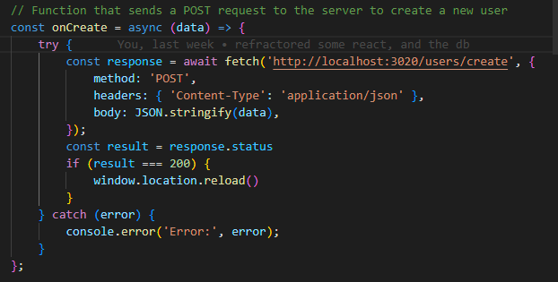

Ovan är funktion som sker när man försöker loggga in, funktionen är kort och är monadic, vilket är posetivt. Däremot kan man diskutera kring hur väl jag följt do one thing, eftersom den både gör requesten, och baserat på svaret utför ett jobb. Och möjligen hade kunnat göra en ny funktion som verkligen bara gör requesten och sedan skickar svaret för att låta det utföras.

Jag har däremot sett till att försöka använda mig av funktioner så mycket som möjligt, framförallt genom min middleware, som sker varje gång en sida laddas in, och andra funktioner som ligger utanför huvudkoden såsom tokenReader.js

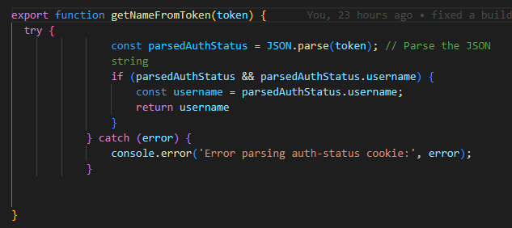


## Kapitel 4

### Comments

Inom kapitel 4 diskuteras kommentarer, där nämner Martin att kommentarer i många fall ska undvikas, tillexempel att det i många fall inte ska behövas kommentarer för att förklara kod, eftersom clean code ska förklara sig själv. Förutom att nämna hur sällan man skall använda sig av kommentarer, så nämner han även javadoc, vilket i mitt fall byts ut mot JSDOC. Martin anser att JSDOC kan vara bra, framförallt vid api's såsom min originella modul, men inte för saker såsom korta enkla funktioner, som en simpel get funktion, eftersom det tar upp mer utrymme än nödvändigt.

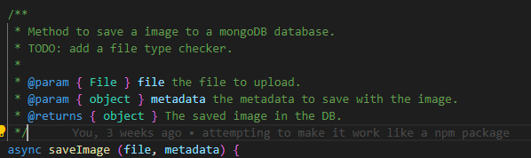

Detta är ett gott exempel på en bra jsdoc kommentar, även om namnet på funktionen förklarar att det är för att spara en bild, så förklarar kommentaren att de är mer specifikt för att spara en bild till en mongoDB databas, annars hade funktionen möjligen kunnat tolkas till en funktion för att sätta en bild till en variabel, parametrarna förklaras även.

Något som martin i detta fall inte hade gillat var TODO kommentaren. Eftersom det aldrig ska behövas.

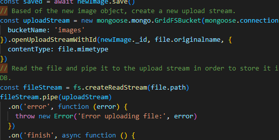

I fallet ovan används kommentarer för att förklara ganska förvirrande kod. Enligt Martin ska inte dessa kommentarerna behövas, för att det ska inte vara särskillt ful kod att man inte förstår utan de. Men jag upplever att de hjälper rätt mycket för att förstå hela funktionaliteten eftersom ett library används.

## Kapitel 5

### Formatting

Kapitel 5 handlar om formatting och i det berättar Martin om hur kod ska formatteras på olika vis. Whitespaces, horizontela delar och vertikala delar samt indentering. Jag anser att det viktigaste från detta kapitlet är att man ska formattera på ett vis enbart, och inte blanda. Samt att följa formatteringsreglerna från sitt "team".

Jag anser att min kod att formatterad på samma sätt igenom hela koden och det är det viktigaste enligt mig.

## Kapitel 6

### Objects and Data structures

I kapitel 6 berättar Martin om skillnaden mellan objekt och data strukturer. Martin anser att ett objekt ska försöka följa sina medlemmar (private) och framförallt använda sig av metoder. Medans Data strukturer hellre ska använda sig av metoderna för sig själv, och enkelt låta andra delar av koden ta användning av sina medlemmar. Martin nämner också att man ska undvika så kallade trainwrecks där objekt kallar varandras metoder hit och dit. Vilket i slutändan blir dålig kod.

Nedan kan man se i min kod hur jag använder mig väl av ett objekt, där det aldrig visar sina medlemmar medans det visar sina metoder mer fritt:

``` javascript
class ImageController {
    constructor() {
        const authStatus = Cookies.get("auth-status");
        this.username = getNameFromToken(authStatus);
    }

    // Function that sends a POST request to the server to upload an image
    async postImage(formData) {
        try {
            const response = await fetch("http://localhost:3020/images", {
                method: "POST",
                body: formData,
            });
            if (response.ok) {
                const result = await response.json();
                return result.data_id;
            } else {
                console.error("Server error:", response.statusText);
                return null;
            }
        } catch (error) {
            console.error("Network error:", error);
        }
    }

    // Function that sends a POST request to the server to add an image to a user
    async addImage(data) {
        try {
            const response = await fetch("http://localhost:3020/users/addImage", {
                method: "POST",
                headers: {
                    'Content-Type': 'application/json',
                },
                body: JSON.stringify(data),
            });
            if (response.ok) {
                const result = await response.json();
                return result;
            } else {
                console.error("Server error:", response.statusText);
                return null;
            }
        } catch (error) {
            console.error("Network error:", error);
        }
    }
    
    async delay(ms) {
        return new Promise(resolve => setTimeout(resolve, ms));
    }
}
```

och nedan kan man se ett bättre exempel på en data struktur, vilket är mina mongoDB modeller där datan ska ligga på framsidan utan att vara gömd, och mer fokuserad på att vara sparad på ett visst sätt:

``` javascript
const schema = new mongoose.Schema({
  username: {
    type: String,
    required: true,
    trim: true,
    minlength: 1
  },

  password: {
    type: String,
    required: true,
    trim: true,
    minlength: 1
  },
  images: {
    type: Array,
    required: false
  }
})

```

## Kapitel 7

### Error handling

I kapitel 7 diskuterar Martin hur man ska hantera errors i sin kod. Han nämner hur man skall använda sig av try-catch block, men ha de i den övre delen av koden, istället för att lägga catch statementen i botten, man skall fokusera på det som faktiskt kan gå fel istället för alltihop. Han nämner också att man skall undvika error codes, och inte returna null.

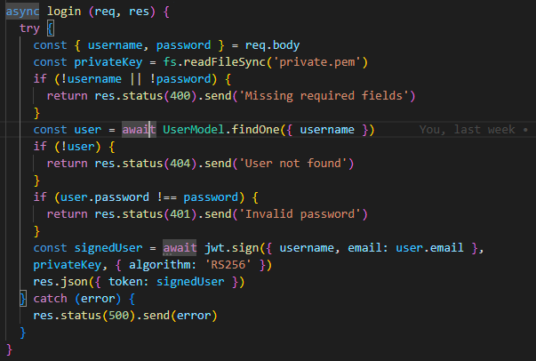

i koden ovan kan man se hur jag lagt det hela i en try catch funktion, är detta nödvändigt? Inte nödvändigtvis jag behöver try funtkionen för att skanna filen, och signa JWT'n, samtidigt kan jag inte göra detta innan jag ser till att allt som behövs behövs. Och statuskoderna anser ju Martin är fel, men när det kommer till https protokollet så behövs ju statuskoder för att enklare kunna kommunicera mellan system. Eftersom jag då kan enkelt veta i min frontend vad för något som gått fel.

## Kapitel 8

### Boundaries

I kapitel 8 diskuteras boundaries, framförallt kring paket. Det nämns att dessa borde ha tester och testas. Det nämns också att vid använding av externa bibliotek, så borde man skapa egna funktioner som använder sig av dessa bibliotek så att man enklare kan justera sin kod vid ändringar av dessa bibliotek. Martin betonar även vikten i att inte låta tredjepartskod ta över sin egna kod, eftersom man skall begränsa det på ett sätt som gör det lätt att underhålla vid ändringar hos tredjepartskoden.

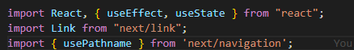

Så något negativt med nextJs är hur hela det är ett tredjedelspaket. Så till exempel när de går till en ny verision, så ändras mycket och man kan behöva ändra en stor del av sin kod för att migrera till den nya varianten.

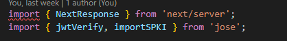
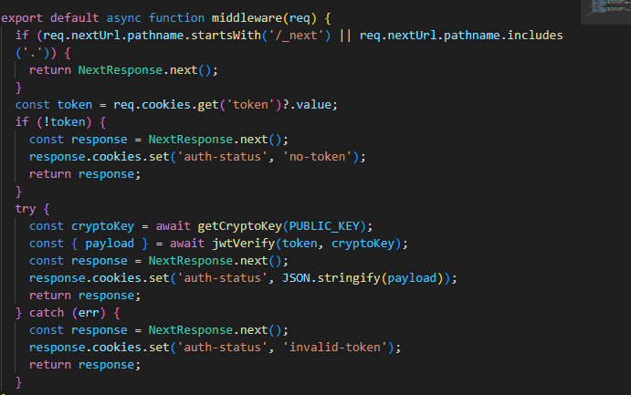

däremot är det jag gjort ovan ett bra sätt att ta hand om tredjedels paket, där jag enbart använder den koden i den delen av koden, för att se till att jag enkelt kan justera allt som angår "jose"

## Kapitel 9

### Unit tests

I kapitel 9 berättas det om unit tests. det första som nämns är TDD:

- First Law: You may not write production code until you have written a failing unit test.

- Second Law: You may not write more of a unit test than is sufficient to fail, and not compiling is failing.

- Third Law: You may not write more production code than is sufficient to pass the currently failing test.

Han nämner också hur även test ska vara clean, de skall framförallt ha en god readability vilket är något jag känner att jag öppnått väl:

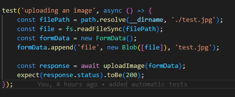
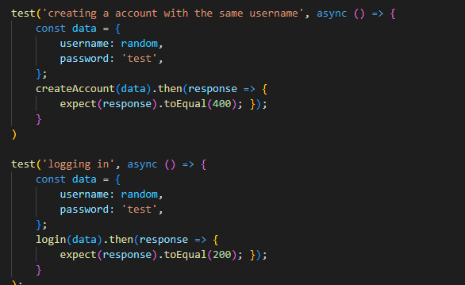

han nämner även att det skall vara ett koncept per test, så jag har ju gjort detta genom att göra ett test för att skapa ett konto och ett för att logga in, istället för creating and logging in test.

Martin nämner även F.I.R.S.T

- Fast
- Independent
- Repeatable
- Self-validating
- Timely

- Fast anser jag att mina tester är.
- Independent anser jag inte mina tester är, eftersom man måste skapa ett konto innan man kan logga in. Men samtidigt är det omöjligt att göra på ett annat sätt om man vill behålla one concept per test
- Repeatable ska funka, sålänge allt är igång på ens egna dator, och på rätt port så kommer de att fungera
- Self validating gör jag ungefär, antingen passar de eller så failar de, men de baseras ju också på statuskoder eftersom det är så https funkar.
- Timely, jag var dum nog att skriva mina tester efter koden var klar, vilket jag var fel och något jag vill ändra på. Eftersom jag behövde ändra testerna för att passa till koden, medans det borde vara tvärt om. (detta var bara pågrund av statuskoder däremot)

## Kapitel 10

### Classes

I detta kapitlet berättar Martin om klasser, de skall vara, liknande till funktioner, små och inte ha för många ansvarigheter. Cohesion nämns även där klasser ska undvika att ha för många medlemmar och att det är optimalt att varje klass använder sig av varje medlem. Detta leder enligt Martin till fler små klasser vilket är något posetivt. Klasser ska också enkelt kunna ändras.

Eftersom som tidigare nämnt nextJs är ett funktionellt programmerings "språk" så var det svårt att göra det objektorienterat. Däremot har jag lyckats rätt väl när jag gjort så kallade controllers för vissa komponenter:

``` javascript
class ImageController {
    constructor() {
        const authStatus = Cookies.get("auth-status");
        this.username = getNameFromToken(authStatus);
    }

    // Function that sends a POST request to the server to upload an image
    async postImage(formData) {
        try {
            const response = await fetch("http://localhost:3020/images", {
                method: "POST",
                body: formData,
            });
            if (response.ok) {
                const result = await response.json();
                return result.data_id;
            } else {
                console.error("Server error:", response.statusText);
                return null;
            }
        } catch (error) {
            console.error("Network error:", error);
        }
    }

    // Function that sends a POST request to the server to add an image to a user
    async addImage(data) {
        try {
            const response = await fetch("http://localhost:3020/users/addImage", {
                method: "POST",
                headers: {
                    'Content-Type': 'application/json',
                },
                body: JSON.stringify(data),
            });
            if (response.ok) {
                const result = await response.json();
                return result;
            } else {
                console.error("Server error:", response.statusText);
                return null;
            }
        } catch (error) {
            console.error("Network error:", error);
        }
    }
    
    async delay(ms) {
        return new Promise(resolve => setTimeout(resolve, ms));
    }
}
```

så denna klassen är rätt liten, gör inte särskillt mycket och har få medlemmar, däremot är en nackdel att jag inte använder mig av username i själva metoderna utan istället i min huvudkod.

## Kapitel 11

### Systems

Martin berättar i kapitel 11 om system i sitt hela. Han berättar om att man skall separera uppstart från användning, genom att i början fokusera på de viktiga delarna av koden innan man kan börja tänka på hur de skall användas direkt. Martin nämner även att kodbaser i sig ska vara skalbara, och att just-in-time beslut är posetiva, där design av systemet skall ske så sent som möjligt eftersom det leder till ett mer flexibelt system.

Något jag följt bra i detta är att dela upp mitt system mellan en frontend och backend, medans jag hade kunnat skapa bägge i nextjs, dessutom skapade jag min backend före min frontend, och på så sätt separerade jag uppstart från användingen av systemet.
