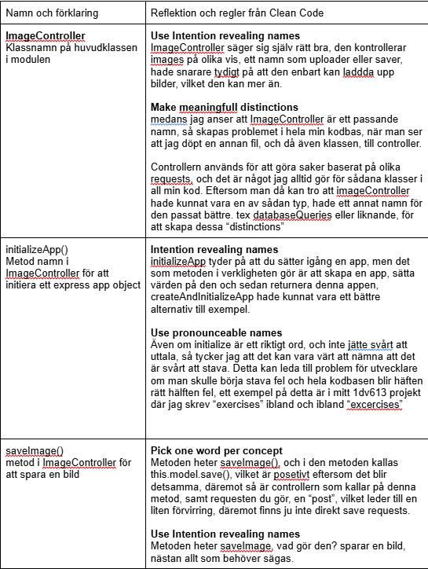
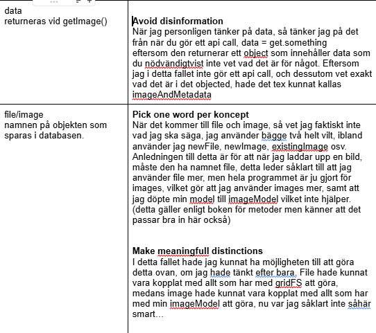
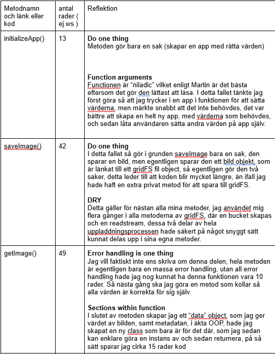
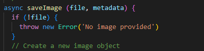

# Rapport

## Skapat av Benjamin Karlsson för kursen 1dv610

# Namngivnings Tabell

# Clean code kapitel 2 reflektion

Efter att ha läst kapitel 2 finns det ett antal olika saker som jag hakade upp mig på. 

När det kommer till hela konceptet av att ha namn som är enkla att läsa, enkla att uttala, enkla att förstå osv. Håller jag helt och hållet med, och jag känner personligen att detta är något som är lätt för många programmerare att också göra, jag tror det tar ett fåtal egen gjorda program innan man förstår att det framförallt blir lättare för en sjäv att förstå koden om namnen enkelt kan läsas och förstås.

Däremot känns det som att vissa saker i kapitlet känns onödiga. Framförallt "Dont be cute" eftersom det känns som en sån sak som en programmerare i en seriös miljö själv borde veta. 

Hela add meaningful Context delen säger om du har en en massa värden för en address, kan du lägga till "addr" i början, för då blir det tydligare för läsaren, men då motsäger ju han sig själv eftersom du ska undvika "encodings". Dessutom kan hela problemet med att om du ser address någon annanstans i koden, lösas med en ganska enkel kommentar. För det är ju vad kommentarer är gjorde för. Däremot nämner han ju sen att det är bättre att skapa en helt egen address klass för att använda sig av vilket jag håller med om

Och när det kommer till kommentarer så upplever jag att Martin på något sätt totalt ignorerar att de finns. Jag kan förstå att man vill undvika kommentarer mitt i koden, men personligen ser jag hellre kommentarer och förstår något på en sekund, än att behöva tänka i 10 sekunder innan jag förstår vad namnet faktiskt betyder.

Jag uppskattar till en viss del martins final words. Martin påstår att det krävs en viss förmåga, och gemensam kultur (arbets gissar jag på) för att kunna skapa bra namn, och detta håller jag med om, framförallt eftersom jag är en otroligt stökig kodare. Att Martin nämner att man ibland inte vill ändra namn på grund av en rädsla att andra inte håller med om det nya kan jag förstå, men det tror jag inte är huvudproblemet i svårheten till att byta namn på klasser, variabler etc. Det största problemet enligt mig är rädslan att hela kodbasen fallerar, vilket den oftast gör, och inte kommer sluta göra förräns efter 20 minuter av kodjusteringar. Detta problem stöttar ju däremot hela resten av hans text, eftersom det bästa i den situationen då är att försöka skriva korrekta namn från början.

# Funktions tabell

# Clean code kapitel 3 reflektion

Jag kommer börja denna reflektionen med att diskutera kring det första Martin nämner, längden på funktioner. Martin anser att funktioner sällan ska vara mer än 20 rader kod. Detta håller jag inte med om. Att bara göra vissa API-calls kan ta iallafall 10 rader kod, att sedan kolla verifiera datan, ha ett exception, och göra något kort med en bit av datan, för att sedan returnera den kommer att ta yttligare kanske 10 rader. Lägg till någon kommentar och helt plötsligt är du över 20 varje gång du gör ett api call.

Jag tycker Martin har många bra poänger som tillexempel att en funktion ska göra enbart en sak, men det måste finnas gränser. I samma exempel med api-callet, känns det otroligt onödigt om jag ska ha en funktion, för att göra anropet, följt av en funktion för att ta ut datan, följt av en funktion för att göra en mattematisk funktion med den datan från tidigare funktion.

Det blir en lång rad av olika funktioner vilket inte gynnar någon.

Samma sak gäller kring Martins åsikter kring argumenten i funktioner, Martin antyder att "niladic" funktioner är bäst, och att en och även två argument funkar bra. Men då skapas ju också problemet av att om jag uppmuntras till att enbart använda mig av ett argument, kommer jag istället för att använda mig av ett object med alla värderna som behövs, och då kommer koden snarare bli svårare att förstå när massa olika medlemmet uppstår från ingenstans.

Nu kommer dessa åsikter i och för sig från en framförallt javascirpt baserad backend programmerare, som också har svårt att förstå (och därmed ogillar starkt) objektorienterad programmering. Om man är mer objectorienterad än vad jag är, så tror jag att Martins åsikter ovan kan vara mer realistiska.

Däremot finns det såklart andra saker som jag kan hålla med Martin om, såsom att funktioner ska vara tydliga i vad de gör, samt att errors är bättre än error codes.

Min favoritdel i kapitel 3 är DRY - dont repeat yourself. Det finns sällan en bättre känsla än att ha en viss mänd kod, och sedan kunna korta ner den till halva storleken genom att skapa bara några funktioner, och det känns även bra när man sedan vet att man kommer kunna använda sig av funktionen igen. Nu är jag tyvärr inte särskilt bra på detta, vilket kan synas i min modul, men jag går ju trottsallt denna kursen för att bli bättre på just sådana saker.

# Egen reflektion

Efter denna uppgift, samt workshopen vi hade kring code reviews så har jag insett ett flertal negativa saker som jag gör inom min kod. Jag har även upptäckt saker som jag tycker jag gör rätt, men som Martin anser är felaktigt. Det är lite ögonöppnande att man själv kan förstå hur mycket smidigare man kan göra något om man bara gör en självreflektion, istället för att skriva sin kod, få det att funka och sedan nöjer sig.

Det första jag skulle vilja gå in på är skillnaden mellan min updateImage() metod och min saveImage() metod. Det första man ser är hur koden skiljer sig med bara den generella stilen, medans saveImage inte är perfekt, så är det en monadic metod, medans update är en dyadic, där jag har gjort en “pun” genom att använda file och fileId som egentligen är två helt olika saker. Delvis på grund av den dåliga namngivningen har koden inte funkat, och då har den lämnats där för framtida arbete. På grund av det kan man se hur min kod ser ut medan jag programmerar och testar runt, till skillnad från min slutprodukt. Man kan även se vad som sker när jag inte följer Martins åsikt kring att använda ett ord per koncept, när jag använder mig av både file och fileId, som tidigare nämnt är helt åtskilda.

Ännu en sak jag förstått att jag måste bli bättre på är längden av mina metoder, och att använda mig mer av privata metoder, som jag kan återanvända. Det bästa exemplet på detta är varje gång jag skapar en bucket och pipestream, för att sedan pipea osv, detta hade jag kunnat lägga i en egen privat metod för att kunna återanvända det, och skapa renare metoder som är del av det publika interfacet, och med det lite mer synliga för andra programmerare.

Jag anser även att jag måste bli bättre på felhantering, och vara mer öppen för att igen försöka skapa flera funktioner, som gör enbart en sak, såsom felhanteringen.

Jag upplever däremot att jag har gjort vissa saker bra, jag tycker min dokumentation, framförallt med hjälp av JSdoc, är snygg och tydlig, och även att mina kommentarer tillför med det de ska. Och även om jag ibland har whitespaces vilket vissa är emot, så anser jag att de skapar en viss tydlighet i koden.

Jag anser också att jag gjorde vissa val korrekt, trots att de trotsar mot Martin. Det bästa exemplet på detta är i saveImage() där den både sparar ett image objekt till mongoDB, och en fil till gridFS. Även om detta går emot Martins åsikt om att ha en funktion göra en sak, och jag själv tycker att jag hade kunnat dela upp just den metoden i några fler funktioner, så tycker jag att det gjordes på ett smidigt och smart sätt som var bäst för att uppfylla funktionaliteten.

Slutsatsen av denna rapport är att trots att min kod är långt ifrån perfekt, så lärde jag mig betydligt mycket mer än förväntat, framförallt av att skriva hela rapporten med reflektion texterna. Och jag tror detta kommer ge mig en bra grund inför laboration 3.

